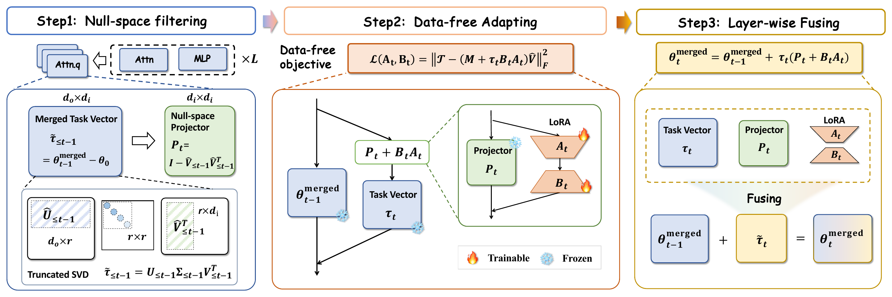

<div align='center'>

# Null-Space Filtering for Data-Free Continual Model Merging: Preserving Stability, Promoting Plasticity

</div>


This repository contains the PyTorch implementation of the paper:

[Null-Space Filtering for Data-Free Continual Model Merging: Preserving Stability, Promoting Plasticity (ICLR 2026)](https://arxiv.org/pdf/2509.21413)


## Abstract

Data-free continual model merging (DFCMM) aims to fuse independently fine-tuned models into a single backbone that evolves with incoming tasks without accessing task data.
This paper revisits two fundamental desiderata for DFCMM: *stability*, avoiding interference with earlier tasks, and *plasticity*, adapting faithfully to each new task. This poses a challenge that existing approaches fail to address: how to bridge data-level desiderata with parameter-space optimization to ensure stability and plasticity in the absence of task data.
To this end, we propose **NUFILT** (**Nu**ll-space **Filt**ering), a data-free framework that directly links these desiderata into parameter-space optimization. Our key observation is that task vectors approximately align with representation subspaces, providing structural surrogates for enforcing stability and plasticity.
Accordingly, we design a null-space projector that preserves prior responses by filtering overlapping components of new task vectors, ensuring stability.
We further introduce a lightweight LoRA adapter that injects complementary task-specific signals to enable plasticity.
The adapter is trained with a projection-based surrogate loss that preserves consistency with prior knowledge while introducing novel directions.
This joint filtering-adaptation process enables the backbone to absorb new knowledge while retaining existing behaviors, with updates fused back in a layer-wise linear fashion without extra parameters or inference cost.
Theoretically, we establish approximate subspace alignment guarantees that justify null-space filtering. Empirically, **NUFILT** achieves state-of-the-art performance with minimal forgetting on both vision and NLP benchmarks, improving average accuracy by 4-7\% over OPCM and WUDI-Merging, while narrowing the gap to fine-tuning and reducing computation overhead.

## Overview

<p align="center">
  
</p>

<p align="center">
Overview of the <b>NUFILT</b> procedure. 1) <b>Filtering</b>: the new task vector is processed through a null-space projector that suppresses activations from previous tasks, ensuring stability to past knowledge. 2) <b>Adapting</b>: within the filter, a lightweight LoRA adapter refines the update for the current task using a data-free objective. 3) <b>Fusing</b>: the filter, task vector, and LoRA module are merged back into the backbone, keeping the parameter count and inference cost unchanged.
</p>


## Introduction to DFCMM

**Data-Free Continual Model Merging (DFCMM)** aims to continually absorb new task knowledge into a shared backbone without revisiting any task data.

- **Stability**: preserve the behaviors learned from previous tasks and avoid destructive interference during merging.
- **Plasticity**: faithfully incorporate the knowledge carried by each incoming task vector.
- **Challenge**: without task data, stability and plasticity must be enforced directly in parameter space rather than through data-driven objectives.

**NUFILT** addresses this challenge with two complementary components:

- **Null-space filtering** removes overlapping components of new task vectors in representation-aligned subspaces, helping preserve prior responses.
- **LoRA-based adaptation** injects complementary task-specific signals through a lightweight adapter trained with a projection-based surrogate loss.

Together, these components enable continual model merging that remains stable on earlier tasks while staying plastic enough to acquire new knowledge.

## Installation

install the latest version in development

```bash
pip install -e . # install the package in editable mode
```

## Project Structure

The project is structured as follows:

- `fusion_bench/`: the main package of the benchmark.
  - `method`: contains the implementation of the fusion methods.
    > **naming convention**: `fusion_bench/method/{method_name}/{variant}.py` contains the implementation of the specific method or its variants.
      For example, `fusion_bench/method/regmean/clip_regmean.py` contains the implementation of the RegMean algorithm for CLIP vision models.
  - `modelpool`: contains the implementation of the model pool, responsible for managing the models and dataset to be loaded.
  - `taskpool`: contains the implementation of the task pool, responsible for evaluating the performance of models returned by the algorithm.
- `config/`: configuration files for the benchmark. We use [Hydra](https://hydra.cc/) to manage the configurations.
  - `method`: configuration files for the fusion methods.
    > **naming convention**: `config/method/{method_name}/{variant}.yaml` contains the configuration for the specific method or its variants.
  - `modelpool`: configuration files for the model pool.
  - `taskpool`: configuration files for the task pool.
  - `model`: configuration files for the models.
  - `dataset`: configuration files for the datasets.
- `examples/`: example scripts for running some of the experiments.
  > **naming convention**: `examples/{method_name}/` contains the files such as bash scripts and jupyter notebooks for the specific method.

## How to run the experiments

We provide bash scripts to reproduce the results in the paper.  
All scripts are located in the examples/nufilt folder.

### Reproducing Tables

- bash examples/nufilt/baseline.sh

- bash examples/nufilt/nufilt.sh

- bash examples/nufilt/t5_base.sh


## Acknowledgements

This project is based on [FusionBench](https://github.com/tanganke/fusion_bench). We thank the authors for their valuable contribution.

In this repository, we only keep the essential code required to reproduce the results in the **NUFILT** paper.  
For the full benchmark codebase and additional functionalities, please refer to [FusionBench](https://github.com/tanganke/fusion_bench).
## Citation

If you find our work useful, please consider citing:
```
@inproceedings{
qiu2026nullspace,
title={Null-Space Filtering for Data-free Continual Model Merging: Preserving Stability, Promoting Plasticity},
author={Zihuan Qiu and Lei Wang and Yang Cao and Runtong ZHANG and Bing Su and Yi Xu and Fanman Meng and Linfeng Xu and Qingbo Wu and Hongliang Li},
booktitle={The Fourteenth International Conference on Learning Representations},
year={2026},
url={https://openreview.net/forum?id=HDIf3fYqPP}
}

```
